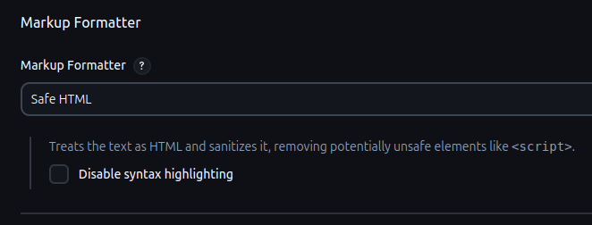
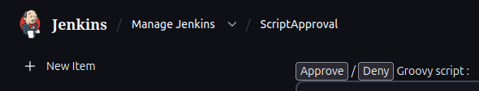
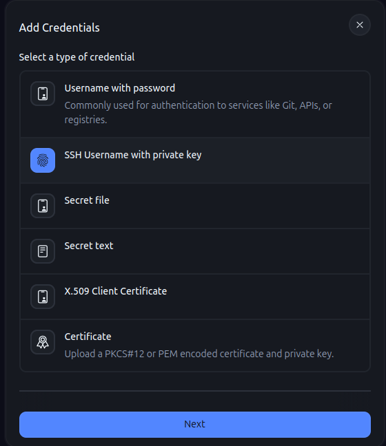
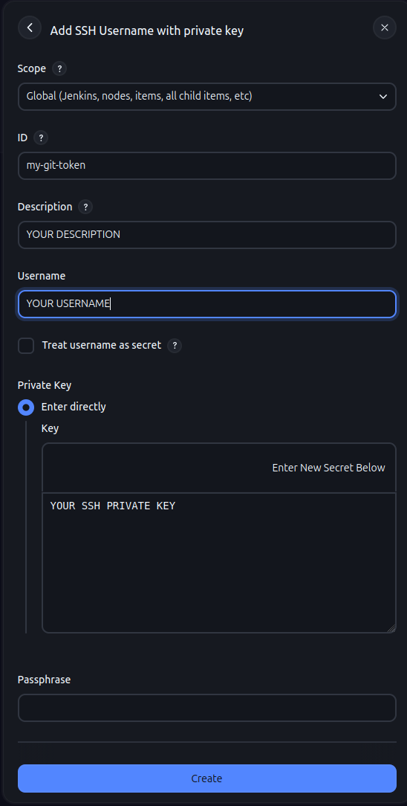
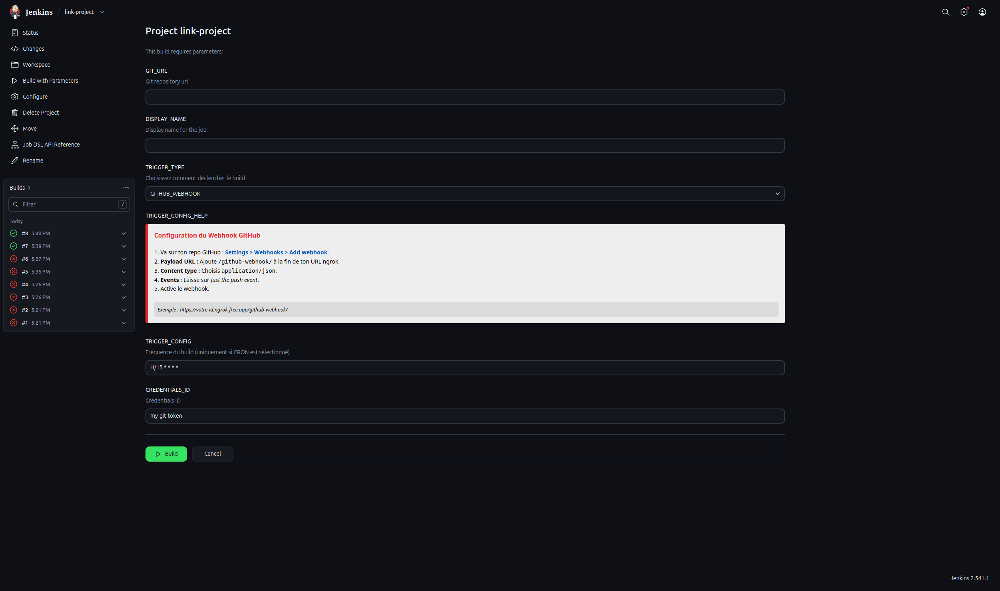

 # Link your repository to the  Jenkins instance

 Use Jenkins to automatically build, dockerize and deploy your application. This guide covers the minimal steps to link a Git repository and run the generated pipeline.

 ## 1 - Configure Jenkins (first start)

  **Configure HTML**

 On first start you will need to configure how Jenkins should react to HTML. In the Jenkins UI navigate to `Manage Jenkins` → `Security` and find `Markup Formater` once you find it replace Plain text by Safe HTML

  

 **Approve scripts**

 On first start you will need to approve the Job DSL / Groovy scripts so they can run. In the Jenkins UI navigate to `Manage Jenkins` → `In-process Script Approval` and approve the pending scripts.

 

 **Add SSH credentials**

 Add your SSH private key in Jenkins: `Manage Jenkins` → `Credentials` → create a new credential of type *SSH Username with private key*. Use the credential ID `my-git-token` if you want to keep the default used by the templates.

 

 Fill the credential form as in the screenshot below (ensure the ID is `my-git-token` if you follow the examples in the repo).

 

 ## 2 - Link your first project

 Open the `link-project` job in Jenkins and click **Build with Parameters**.

 

 Required fields:
 - `GIT_URL`: the repository URL used to clone. Example SSH: `git@github.com:Octopus/HelloWorld.git`. HTTPS example: `https://github.com/owner/repo.git`.
 - `DISPLAY_NAME`: a unique short name for the project inside Whanos.

 Validation rules for `DISPLAY_NAME`:
 - Allowed characters: lowercase ASCII letters, digits and `-`
 - Length: 1 to 20 characters
 - Regex used by the template: `[a-z\d\-]{1,20}`

 After submitting the form the seeding job will create a pipeline job named `Projects/<DISPLAY_NAME>` and queue it. Jenkins will then either wait for GitHub push webhooks (if selected) or poll according to the cron you set.

 ## 3 - Quick test

 - Trigger `Build with Parameters` for `link-project` and verify that the generated job `Projects/<DISPLAY_NAME>` is created.
 - Open the generated job and click **Build Now** to run immediately.
 - Check the build `Console Output` to ensure the repository is checked out and the pipeline runs.

 ## Notes & best practices
 - Do not commit private SSH keys or secrets into this repository.
 - If you choose webhook mode, add a webhook in your GitHub repo: `Settings` → `Webhooks` → `Add webhook` with `Payload URL` set to `https://YOUR_DOMAIN/github-webhook/`, `Content type` → `application/json`, and events: *Just the push event*.
 - If a Job DSL or Groovy script is blocked, go to `Manage Jenkins` → `In-process Script Approval` to allow it.

 Congratulations - your project is linked!